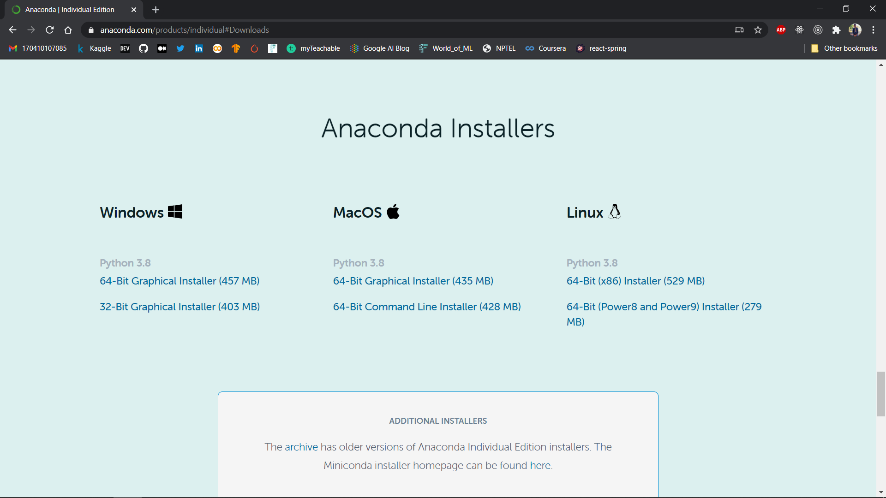
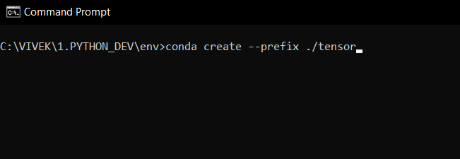
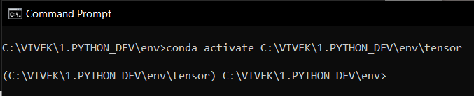
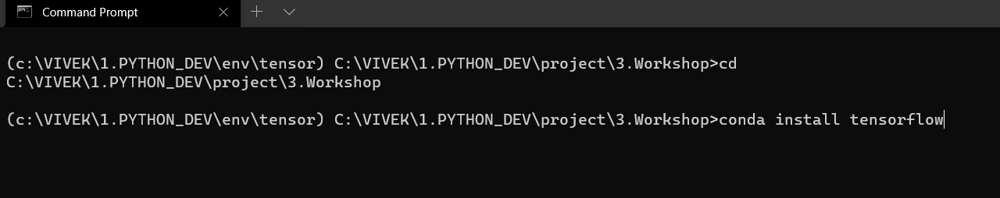

## Setup your local computer.

First you have to download [anaconda](https://www.anaconda.com/products/individual#Downloads)

1. Download and install it.
   - Make sure you check evn path of your anaconda.
   - If not you can add with Environment Variables from control panel(**WINDOWS**).
2. Open `terminal` .
   - create a new folder
   - Go to that folder.
   - Create env with `conda create --prefix ./NAME_OF_YOUR_ENV`
   
   - You can activate env with `conda activate PATH_OF_YOUR_ENV`.
   
3. Install packages.
   - Install package with `conda install package_name`
   
   - Intall the following packages
     - TensorFlow
     - Numpy
     - Scikit-learn
     - Pandas
     - Matplotlib
     - Seaborn
     - Jupyter notebook
