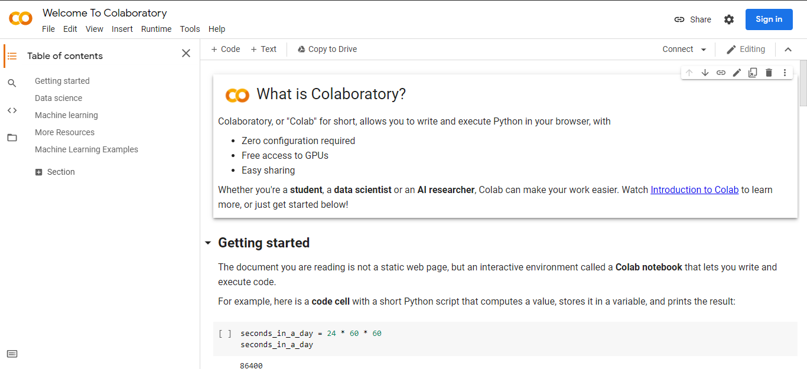

## Setup Python for ML on your local machine.

To work with python for Machine learning according to this guide, the preferable environment which we suggest would be [Anaconda](#setting-up-anaconda) if you have a modern powerful computer or else [Google Colab](#setting-up-google-colab) if you have good internet access.

---

### Setting up Anaconda

To get started with Anaconda for ML, first you'll have to download [Anaconda](https://www.anaconda.com/products/individual#Downloads)

#### Steps to follow.
1. Download and install it Anaconda.
   - Make sure you check the environment path of your anaconda.
   - If not you can add with Environment Variables from control panel (**WINDOWS**).
2. Open `terminal` to setup the local environment for development.
   - Create a new folder where all of your code for this ML guide would reside.
   - Go to that folder.
   - Create the anaconda env with `conda create --prefix ./<NAME_OF_YOUR_ENV>`. 
   
   - You can activate env with `conda activate <PATH_TO_YOUR_ENV>`. 
   
3. Install packages necessary for this guide.
   - Install package with `conda install <PACKAGE_NAME>`. 
   
   - Install the following packages
     - Numpy
     - Matplotlib
     - Pandas
     - Scikit-learn
     - TensorFlow
     - Seaborn
     - Jupyter notebook

---

### Setting up Google Colab

Google Colab (Google Colaboratory) allows anybody to write and execute arbitrary python code through the browser, and is especially well suited to machine learning, data analysis and education.

To get started with google Colab, Head-out to: [Google Colab](https://colab.research.google.com/)
